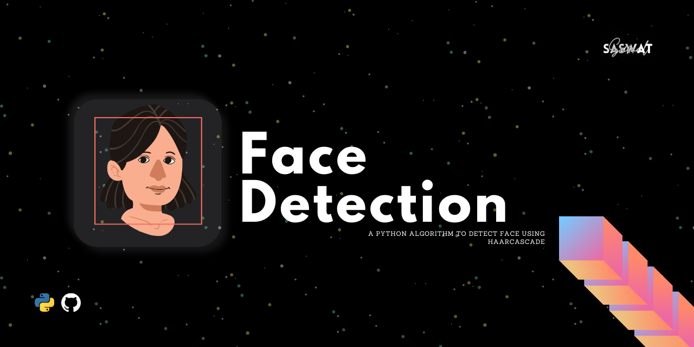

# Face Detection 



## What is Face Detection?
Face detection is a computer technology being used in a variety of applications that identifies human faces in digital images. Face detection also refers to the psychological process by which humans locate and attend to faces in a visual scene.

## What are Haar Cascades?
- Haar Cascade classifiers are an effective way for object detection. 
- Proposed by Paul Viola and Michael Jones in their paper Rapid Object Detection using a Boosted Cascade of Simple Features [↗](https://www.researchgate.net/publication/3940582_Rapid_Object_Detection_using_a_Boosted_Cascade_of_Simple_Features)
- It is a machine learning-based approach where a lot of positive and negative images are used to train the classifier.
  - Positive images – These images contain the images which we want our classifier to identify.
  - Negative Images – Images of everything else, which do not contain the object we want to detect.
  
(Know more [here ↗](https://opencv-python-tutroals.readthedocs.io/en/latest/py_tutorials/py_objdetect/py_face_detection/py_face_detection.html)).

## Haar-cascade Detection in Python(OpenCV)
- OpenCV comes as a detector which uses Haar Cascade.
- In face detection, we use the *Haarcascade Frontal Face* which is in `xml` format.

---

# Let's jump into the code
### What are the requirements you need to have before running the code (all latest version)
```python
--- python
--- opencv-python
--- haarcascade_frontalface_default.xml
```
Download the haar cascade files [here ↗](https://raw.githubusercontent.com/saswatsamal/faceDetection/master/haarcascade_frontalface_default.xml)

### First we need to load the required XML classifiers. Then load our input image (or video) in grayscale mode.
```python
import numpy as np
#importing the OpenCV Lib
import cv2

#Loading the haarcascade front face file
faceCascade = cv2.CascadeClassifier('haarcascade_frontalface_default.xml')

#Reading the face image
img = cv2.imread('testFace.jpg')

#Converting the image into grayscale image
gray = cv2.cvtColor(img, cv2.COLOR_BGR2GRAY)
```
### Now we find the faces in the image. If faces are found, it returns the positions of detected faces as Rect(x,y,w,h).
```python
#Detecting the face
face = faceCascade.detectMultiScale(gray, 1.1,4)

#Draw rectangle around the face
for(x,y,w,h) in face:
    cv2.rectangle(img, (x,y),(x+w, y+h), (255,0,0),2)
```
### Now we will show the output
```python
#Display the result with face detected
cv2.imshow('img',img)
cv2.waitKey(0)
cv2.destroyAllWindows()
```
